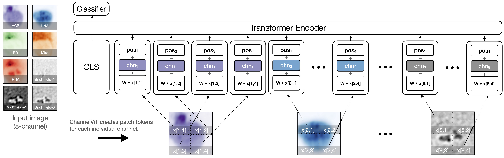

# Channel Vision Transformer: An Image Is Worth C x 16 x 16 Words

Vision Transformer sets the benchmark for image representation. However, unique challenges arise in certain imaging fields such as microscopy and satellite imaging:

1. Unlike RGB images, images in these domains often contain **multiple channels**, each potentially carrying semantically **distinct** and **independent** information.
2. Not all input channels may densely be available at training or test time, necessitating a model that performs **robustly** under these conditions.

In response to these challenges, we introduce ChannelViT and Hierarchical Channel Sampling.

1. ChannelViT constructs patch tokens independently from each input channel. It employs a set of learnable channel embeddings to encode channel-specific information, which are then added to the patch tokens in a manner akin to positional embeddings. This modification enables ChannelViT to perform **cross-channel** and **cross-position** reasoning, a critical feature for multi-channel imaging.
2. Hierarchical Channel Sampling (HCS) employs a two-step sampling procedure to simulate test time channel unavailability during training. Unlike channel dropout, where each channel is dropped independently and biases a certain number of selected channels, the two-stage sampling procedure ensures HCS covers channel combinations with varying numbers of channels **uniformly**. This results in a consistent and significant improvement in robustness.

<figure>
  <p align="center">
  
  </p>
  <figcaption width=80%><em>
  Illustration of ChannelViT. The input for ChannelViT is a cell image from JUMP-CP, which comprises five fluorescence channels (colored differently) and three brightfield channels (colored in B&W). ChannelViT generates patch tokens for each individual channel, utilizing a learnable channel embedding </em><b>chn</b><em> to preserve channel-specific information. The positional embeddings </em><b>pos</b><em> and the linear projection </em><b>W</b><em> are shared across all channels.
  </em></figcaption>
</figure>
<br/>
<br/>

Should you have any questions or require further assistance, please do not hesitate to create an issue. We are here to provide support. 🤗

## Pre-trained Models

We provide the following pre-trained models trained with supervision on ImageNet, JUMP-CP, Camelyon, and So2Sat datasets as presented in our paper.

### Supervised

| Dataset | Name | Backbone | Hierarchical Channel Sampling |
|----------|----------|----------|----------|
| ImageNet    |  imagenet_channelvit_small_p16_with_hcs_supervised | ChannelViT-S/16  | Yes  |
| CP-JUMP (cellpainting)    |  cpjump_cellpaint_channelvit_small_p8_with_hcs_supervised | ChannelViT-S/8  | Yes  |
| CP-JUMP (cellpainting + brightfield)    |  cpjump_cellpaint_bf_channelvit_small_p8_with_hcs_supervised | ChannelViT-S/8  | Yes  |
| Camelyon | camelyon_channelvit_small_p8_with_hcs_supervised | ChannelViT-S/8  | Yes  |
| So2Sat (Random Split) | so2sat_channelvit_small_p8_with_hcs_random_split_supervised | ChannelViT-S/8  | Yes  |
| So2Sat (Hard Split) | so2sat_channelvit_small_p8_with_hcs_hard_split_supervised | ChannelViT-S/8  | Yes  |

We also provide pre-trained models for DINO training on ImageNet.

### DINO

| Dataset | Name | Backbone | Hierarchical Channel Sampling |
|----------|----------|----------|----------|
| ImageNet    |  imagenet_channelvit_small_p16_DINO | ChannelViT-S/16  | No  |

## Pretrained Models on Pytorch Hub

```python
import torch
model = torch.hub.load('insitro/ChannelViT', 'imagenet_channelvit_small_p16_with_hcs_supervised', pretrained=True)
model = torch.hub.load('insitro/ChannelViT', 'cpjump_cellpaint_channelvit_small_p8_with_hcs_supervised', pretrained=True)
model = torch.hub.load('insitro/ChannelViT', 'cpjump_cellpaint_bf_channelvit_small_p8_with_hcs_supervised', pretrained=True)
model = torch.hub.load('insitro/ChannelViT', 'camelyon_channelvit_small_p8_with_hcs_supervised', pretrained=True)
model = torch.hub.load('insitro/ChannelViT', 'so2sat_channelvit_small_p8_with_hcs_random_split_supervised', pretrained=True)
model = torch.hub.load('insitro/ChannelViT', 'so2sat_channelvit_small_p8_with_hcs_hard_split_supervised', pretrained=True)
model = torch.hub.load('insitro/ChannelViT', 'imagenet_channelvit_small_p16_DINO', pretrained=True)

```

## Environment setup

This project is developed based on [PyTorch 2.0](https://pytorch.org) and [PyTorch-Lightning
2.0.1](https://www.pytorchlightning.ai/index.html).
We use [conda](https://docs.conda.io/en/latest/) to manage the Python environment. You
can setup the enviroment by running

```bash
git clone git@github.com:insitro/ChannelViT.git
cd ChannelViT
conda env create -f environment.yml
conda activate channelvit
```

You can then install channelvit through pip.

```bash
pip install git+https://github.com/insitro/ChannelViT.git
```

## Reproducing results on JUMP-CP

This section outlines the steps to reproduce our training and evaluation pipelines using JUMP-CP. The preprocessed JUMP-CP data used in this example was previously released in our work titled, "Contextual Vision Transformers for Robust Representation Learning" ([insitro/ContextViT](https://github.com/insitro/ContextViT)).

### Visualizing correlations among input channels

Before initiating the training of any models, it is beneficial to visualize the correlations among the input channels. The script provided below will load the JUMP-CP data and compute the channel correlations derived from the original cell painting images, without any normalization.

```bash
python channelvit/main/main_correlation.py \
    trainer.devices=8 \
    trainer.max_epochs=100 \
    data@train_data=jumpcp \
    data@val_data_dict=[jumpcp_test] \
    transformations@train_transformations=cell \
    transformations@val_transformations=cell
    val_transformations.normalization.mean=[0,0,0,0,0,0,0,0] \
    val_transformations.normalization.std=[1,1,1,1,1,1,1,1]
```

### Training ViT-S/16 without HCS

Next, we will train a ViT-S/16 model without using HCS. For managing our experiment configuration, we utilize [hydra](https://hydra.cc/). The script provided below will load its corresponding main configuration file, `channelvit/config/main_supervised.yaml`, along with any command line overrides. It trains the ViT-S/16 model to minimize the cross-entropy loss on the JUMP-CP training data over the course of 100 epochs. The process requires 8 GPUs and operates with a batch size of 32 per GPU.

```bash
python channelvit/main/main_supervised.py \
    trainer.devices=8 \
    trainer.max_epochs=100 \
    meta_arch/backbone=vit_small \
    meta_arch.backbone.args.in_chans=8 \
    meta_arch.target='label' \
    meta_arch.num_classes=161 \
    data@train_data=jumpcp \
    data@val_data_dict=[jumpcp_val,jumpcp_test] \
    train_data.jumpcp.loader.batch_size=32 \
    transformations@train_transformations=cell \
    transformations@val_transformations=cell
```

Given that each cell image in JUMP-CP contains 8 channels, we override the input channels to 8. Throughout the training, we save the snapshots in the `./snapshots/` directory. You can alter this path by overriding the value of `trainer.default_root_dir`.

### Training ViT-S/8 with HCS

To train the ViT-S/16 using hierarchical channel sampling, simply override the meta_arch/backbone setting to hcs_vit_small. With this setting, the Hierarchical Channel Sampling (HCS) will perform the following actions for each batch:

1. Randomly determine the number of channels to be used for the current batch.
2. Randomly select the combinations of channels.
3. Scale the selected channels by a factor, which is calculated as the ratio of the total number of channels to the number of selected channels.
The script below provides an example of how to train the ViT-S/8 model using HCS.

```bash
python channelvit/main/main_supervised.py \
    trainer.devices=8 \
    trainer.max_epochs=100 \
    meta_arch/backbone=hcs_vit_small \
    meta_arch.backbone.args.in_chans=8 \
    meta_arch.backbone.args.patch_size=8 \
    meta_arch.target='label' \
    meta_arch.num_classes=161 \
    data@train_data=jumpcp \
    data@val_data_dict=[jumpcp_val,jumpcp_test] \
    train_data.jumpcp.loader.batch_size=32 \
    transformations@train_transformations=cell \
    transformations@val_transformations=cell
```

### Evaluating ViT

The script below will enumerate all possible channel combinations and evaluate the corresponding testing accuracy of the trained model (stored at `PATH_TO_CKPT`). In this case, we set `transformation_mask=True` because ViT assumes the same number of input channels for the patch embedding layer. The unselected channels will be filled with zeros, and the selected channels will be scaled by the ratio of the total number of channels to the number of selected channels.

```bash
python channelvit/main/main_supervised_evalall.py \
    trainer.devices=8 \
    transformation_mask=True \
    data@val_data=jumpcp_test \
    val_data.jumpcp_test.loader.batch_size=32 \
    val_data.jumpcp_test.args.channels=[0,1,2,3,4,5,6,7] \
    transformations=cell \
    checkpoint=${PATH_TO_CKPT}
```

### ChannelViT-S/16 without HCS

Training ChannelViT follows a similar process to training ViT. All you need to do is override the meta_arch/backbone setting.

```bash
python channelvit/main/main_supervised.py \
    trainer.devices=8 \
    trainer.max_epochs=100 \
    meta_arch/backbone=channelvit_small \
    meta_arch.backbone.args.in_chans=8 \
    meta_arch.target='label' \
    meta_arch.num_classes=161 \
    data@train_data=jumpcp \
    data@val_data_dict=[jumpcp_val,jumpcp_test] \
    train_data.jumpcp.loader.batch_size=32 \
    transformations@train_transformations=cell \
    transformations@val_transformations=cell
```

### ChannelViT-S/8 with HCS

Given that the patch token of ChannelViT originates from a single channel, applying HCS with ChannelViT essentially results in a shorter input patch sequence for the model. Unlike ViT, where we need to perform input rescaling to maintain smooth input distributions when different channels are used, with ChannelViT we can simply exclude the patches corresponding to the unselected channels from the input sequence.

The following script provides an example of how to train the ChannelViT-S/8 model using HCS.

```bash
python channelvit/main/main_supervised.py \
    trainer.devices=8 \
    trainer.max_epochs=100 \
    meta_arch/backbone=hcs_channelvit_small \
    meta_arch.backbone.args.in_chans=8 \
    meta_arch.target='label' \
    meta_arch.num_classes=161 \
    data@train_data=jumpcp \
    data@val_data_dict=[jumpcp_val,jumpcp_test] \
    train_data.jumpcp.loader.batch_size=32 \
    transformations@train_transformations=cell \
    transformations@val_transformations=cell
```

### Evaluating ChannelViT

The performance of the trained models can be evaluated over all channel combinations using the `main_supervised_evalall.py` script, similar to the evaluation process for ViT. However, there is one key difference. As we consider input channels as the sequence length of the transformer encoders, we set `transformation_mask=True`. This means we don't need to reset pixels corresponding to these channels to zero.

```bash
python channelvit/main/main_supervised_evalall.py \
    trainer.devices=8 \
    transformation_mask=True \
    data@val_data=jumpcp_test \
    val_data.jumpcp_test.loader.batch_size=32 \
    val_data.jumpcp_test.args.channels=[0,1,2,3,4,5,6,7] \
    transformations=cell \
    checkpoint=${PATH_TO_CKPT}
```

## Applying ChannelViT to other datasets

### ImageNet

To use the ImageNet 2012 dataset, you must first download it from the [official release](https://image-net.org/challenges/LSVRC/2012/2012-downloads.php). We have provided a dataset class in `channelvit/data/imagenet.py` for loading the ImageNet data. This class requires two dataframes (one for the training split and one for the validation split) with keys path (the path to the image) and label (the image's label). You can specify the path to these dataframes in the Hydra configurations (`channelvit/config/data/imagenet.yaml` and `channelvit/config/data/imagenet_valid.yaml`).

### Camelyon17

We suggest using the official WILDS package to download the Camelyon17-WILDS dataset.

```bash
pip install wilds
# This will download the labeled data under wilds_base_path/
python wilds/download_datasets.py --root_dir wilds_base_path
```

After successfully downloading the data, you can set the base path of the WILDS dataset in the Hydra configuration (for example, `channelvit/config/data/camelyon_train.yaml`).

### So2Sat

To download the So2Sat dataset, follow the instructions in the [official release](https://github.com/zhu-xlab/So2Sat-LCZ42). We use the first version (hard split) and the third version (random split). We have provided a dataset class in `channelvit/data/so2sat.py` for loading the So2Sat data. This class requires a dataframe with keys path (the path to the image) and label (the image's label). You can specify the path to this dataframe in the Hydra configuration (for example, `channelvit/config/data/so2sat_hard.yaml`).

## Citation

If our work contributes to your research, we would greatly appreciate a citation.

```
@article{bao2023channel,
  title={Channel Vision Transformers: An Image Is Worth C x 16 x 16 Words},
  author={Bao, Yujia and Sivanandan, Srinivasan and Karaletsos, Theofanis},
  journal={arXiv preprint arXiv:2309.16108},
  year={2023}
}
```
